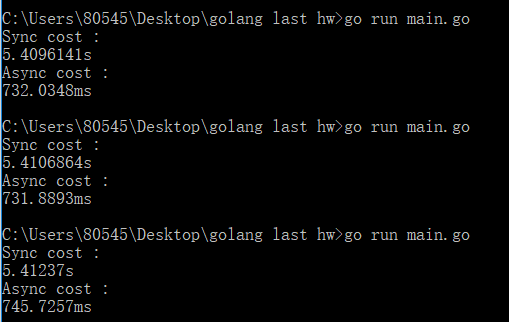

'# async-httpclient

## 练习要求：
> * 依据文档图6-1，用中文描述 Reactive 动机

> * 使用 go HTTPClient 实现图 6-2 的 Naive Approach

> * 为每个 HTTP 请求设计一个 goroutine ，利用 Channel 搭建基于消息的异步机制，实现图 6-3

> * 对比两种实现，用数据说明 go 异步 REST 服务协作的优势

