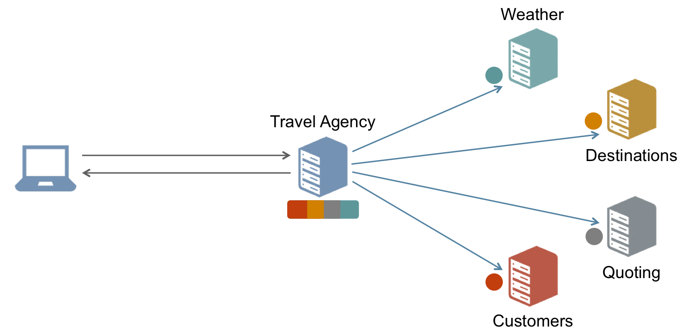

# async-httpclient

## 练习要求：
### 依据文档图6-1，用中文描述 Reactive 动机

* Reactive与同步方法一样，可读性强、实现很容易。
* 同时，Reactive和异步同样快，而且比纯粹的异步方法更具可读性。与异步方法相比，Reactive更便于错误处理操作。

### 使用 go HTTPClient 实现图 6-2 的 Naive Approach

同步方法的缺点是速度慢。需要顺序处理所有的独立请求，这意味着正在浪费资源。

### 为每个 HTTP 请求设计一个 goroutine ，利用 Channel 搭建基于消息的异步机制，实现图 6-3

异步方法通过并行调用独立请求可以降低同步方法所需的时间。

### 对比两种实现，用数据说明 go 异步 REST 服务协作的优势

连跑三次可以看出，异步所花时间确实比同步少，约是同步所需时间的1/7.
